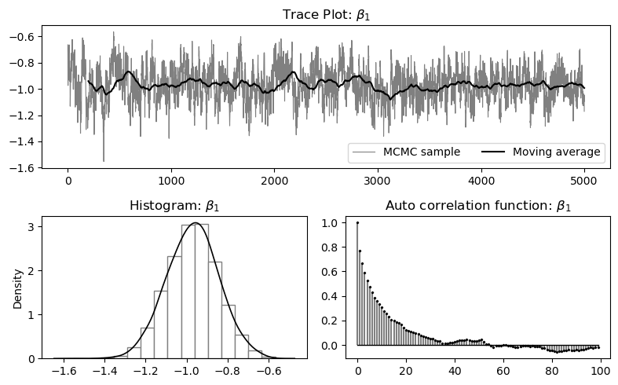
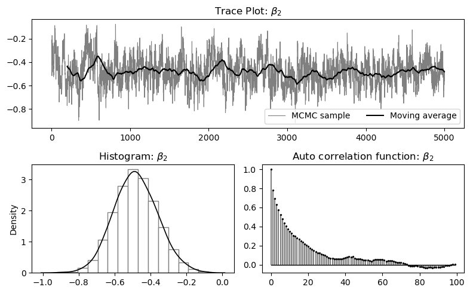
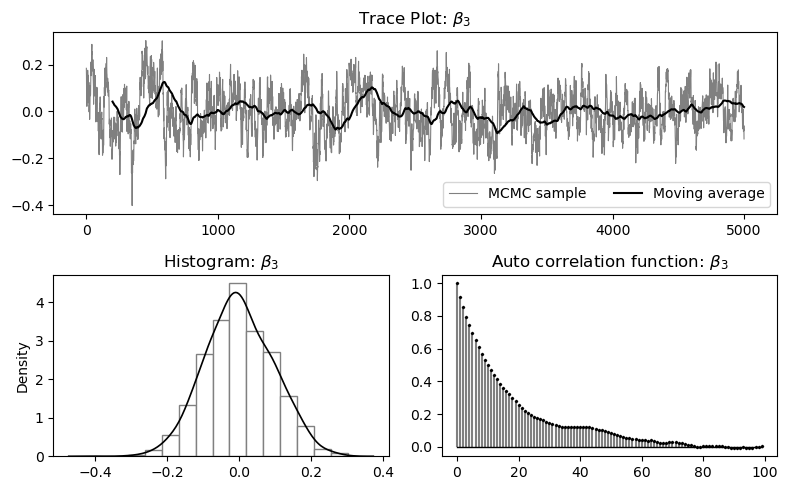
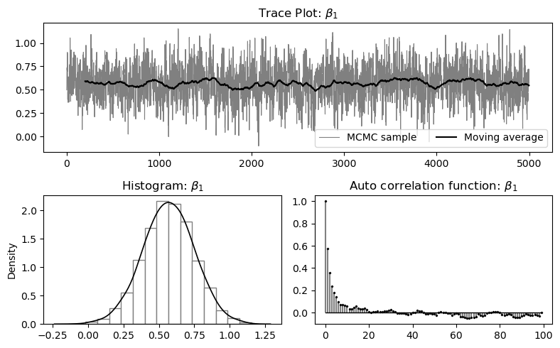
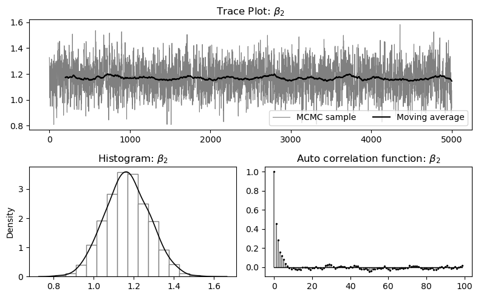

========
Examples
========

This page provides worked examples for the main models supported by :func:`twowaypanel.fit`. The goal is to show *typical econometric workflows*: data preparation, model estimation, bias correction, inference for parameters and average partial effects (APEs), and (when applicable) MCMC convergence checks. For the full code and reproduced outputs used on this page, please refer to the accompanying Jupyter notebook:
`examples.ipynb <https://github.com/zizhongyan/twowaypanel/blob/main/examples/examples.ipynb>`__.

Data used in this page
----------------------

We use two types of data in the examples below.

1. **Binary logit / probit (empirical application)**:
   the package ships a panel dataset based on Angrist and Evans (1998),
   *Children and their parents’ labor supply: Evidence from exogenous variation in family size*
   (American Economic Review). The helper loader is
   :func:`twowaypanel.database.angristevans98`.

2. **Ordered logit / multinomial logit (simulation)**:
   we generate artificial panel data using
   :func:`twowaypanel.demo.PanelGenData`.

   For details of the artificial data generating process (DGP), please refer to the API reference for
   :func:`twowaypanel.demo.PanelGenData` (see the API section of this documentation).

Throughout, the package expects:

- ``Y``: an ``N × T`` array (2D NumPy array is typical),
- ``X``: an ``N × T × K`` array (3D NumPy array),
- ``X_names``: optional labels (list of length ``K``) for readable output tables.

Import and setup
----------------

.. code-block:: python

   import numpy as np
   import twowaypanel

Example 1: Binary logit with strictly exogenous regressors (Angrist and Evans 1998)
-----------------------------------------------------------------------------------

In this example, the dependent variable is a binary labor-force participation indicator
for married women (``LFP``). Regressors include indicators for the number of children
in different age bins and (log) husband income. We estimate a two-way fixed-effects
binary logit panel model.

Step 1: Load and reshape the data
~~~~~~~~~~~~~~~~~~~~~~~~~~~~~~~~~

The helper function :func:`twowaypanel.database.angristevans98` returns a processed
panel dataset. In practice you will typically sort by individual/time indices and
reshape into ``N × T`` (for ``Y``) and ``N × T × K`` (for ``X``).

.. code-block:: python

   data = twowaypanel.database.angristevans98()

   # Typical workflow (exact variable names depend on the shipped dataset):
   data = data.sort_values(["id", "year"])
   N = data["id"].nunique()
   T = data["year"].nunique()

   # Y: LFP (N x T)
   Y = data["lfp"].to_numpy().reshape(N, T)

   # X: covariates (N x T x K)
   X_static  = data.loc[:,['kids0_2','kids3_5','kids6_17','ln_husincome']].to_numpy().reshape(N,T,4)
   X_dynamic  = data.loc[:,['lag_lfp','kids0_2','kids3_5','kids6_17','ln_husincome']].to_numpy().reshape(N,T,5)
   X_static_names = ["Kids 0–2", "Kids 3–5", "Kids 6–17", "ln(hus inc)"]
   X_dynamic_names = ["LFP_t-1", "Kids 0–2", "Kids 3–5", "Kids 6–17", "ln(hus inc)"]

.. note::

   For nonlinear fixed-effects models, some individuals/time periods can be *under-identified*
   (e.g., no within-individual variation in the outcome). The package will drop such units and
   report how many were removed.

Step 2: Joint MLE (no bias correction)
~~~~~~~~~~~~~~~~~~~~~~~~~~~~~~~~~~~~~~

.. code-block:: python

   res_mle = twowaypanel.fit(
       lfp, X_static,
       model="logit", prior=None,
       algorithm="JML",
       X_names=X_static_names
   )

Output
~~~~~~

.. code-block:: text

   --------------------------------------------------------------------------------
   ---- ESTIMATION RESULTS --------------------------------------------------------
                    LOGIT PANEL MODEL WITH TWO-WAY FIXED EFFECTS
                              WITHOUT BIAS CORRECTION
   --------------------------------------------------------------------------------
   Number of Individuals:   664                              Observations:     5976
   Number of Time Periods:    9                            Log-likelihood: -3033.74
   Algorithm: Joint MLE                              Time spent (seconds):    3.190
   --------------------------------------------------------------------------------
   Independent variable    Coefficient     Std. Err.   P>|z|   [95% conf. interval]
   --------------------------------------------------------------------------------
               Kids 0–2   -1.17434565    0.09836036   0.000    -1.36713   -0.98156
               Kids 3–5   -0.59134501    0.08622960   0.000    -0.76035   -0.42234
              Kids 6–17   -0.01566283    0.06075953   0.797    -0.13474    0.10342
            ln(hus inc)   -0.40458145    0.09432568   0.000    -0.58945   -0.21971
   --------------------------------------------------------------------------------

   --------------------------------------------------------------------------------
   ---- AVERAGE PARTIAL EFFECTS ---------------------------------------------------
   --------------------------------------------------------------------------------
   Independent variable    Coefficient     Std. Err.   P>|z|   [95% conf. interval]
   --------------------------------------------------------------------------------
               Kids 0–2   -0.08946279    0.03765011   0.018    -0.16326   -0.01566
               Kids 3–5   -0.04504924    0.01961088   0.022    -0.08348   -0.00662
              Kids 6–17   -0.00119321    0.00463185   0.797    -0.01027    0.00788
            ln(hus inc)   -0.03082141    0.01526161   0.044    -0.06073   -0.00091
   --------------------------------------------------------------------------------
   Note: Panel data contains under-identified observations;
         Dropped 797 out of 1461 individuals, and 0 out of 9 time periods.

- The “Dropped … individuals” message is expected in nonlinear fixed-effects models: individuals with
  no within variation in outcomes contribute little/no information for identifying the slope parameters.

Example 2: Binary logit with strictly exogenous regressors + model-specific prior (MCMC) + convergence diagnostics
------------------------------------------------------------------------------------------------------------------

This example illustrates two features:

1. Using a model-specific bias-reducing prior (tailored for exponential-family models with strictly exogenous regressors).
2. Running the Metropolis–Hastings sampler (``algorithm="MCMC"``) and checking convergence.

.. code-block:: python

   beta_variance = np.array([np.sqrt(1e-1),np.sqrt(1e-2),np.sqrt(1e-2),np.sqrt(5e-5),np.sqrt(5e-7)])
   
   res_mcmc = twowaypanel.fit(
       lfp, X_static,
       model="logit", prior="SE", algorithm="MCMC",
       X_names=X_static_names,
       beta_variance=beta_variance,fe_variance=0.1,
       mcmc_iters=150000, mcmc_burnin=50000, mcmc_skipsize=20,
       mcmc_timer=1, mcmc_sv_mle=True, mcmc_diagnosis=True
   )

Output
~~~~~~

.. code-block:: text

   --------------------------------------------------------------------------------
   ---- ESTIMATION RESULTS --------------------------------------------------------
                    LOGIT PANEL MODEL WITH TWO-WAY FIXED EFFECTS
                USING BIAS-REDUCING PRIOR FOR EXPONENTIAL FAMILY MODELS
                         WITH STRICTLY EXOGENOUS REGRESSORS
   --------------------------------------------------------------------------------
   Number of Individuals:   664                              Observations:     5976
   Number of Time Periods:    9   
   Algorithm: Markov Chain Monte Carlo               Time spent (minutes): 3540.872
              150000 reptitions
   --------------------------------------------------------------------------------
   Independent variable    Coefficient     Std. Err.   P>|z|   [95% conf. interval]
   --------------------------------------------------------------------------------
               Kids 0–2    -0.96974154    0.09139083   0.000    -1.14885   -0.79062
               Kids 3–5    -0.48227300    0.08078112   0.000    -0.64059   -0.32395
              Kids 6–17    0.001101959    0.05723464   0.985    -0.11107   0.113276
            ln(hus inc)    -0.37748241    0.08895669   0.000    -0.55182   -0.20313
   --------------------------------------------------------------------------------
   
   --------------------------------------------------------------------------------
   ---- AVERAGE PARTIAL EFFECTS ---------------------------------------------------
   --------------------------------------------------------------------------------
   Independent variable    Coefficient     Std. Err.   P>|z|   [95% conf. interval]
   --------------------------------------------------------------------------------
               Kids 0–2    -0.09161824    0.03829473   0.017    -0.16667   -0.01656
               Kids 3–5    -0.04556369    0.01987691   0.022    -0.08452   -0.00660
              Kids 6–17    0.000104109    0.00487730   0.983    -0.00945   0.009663
            ln(hus inc)    -0.03566339    0.01644653   0.030    -0.06789   -0.00342
   --------------------------------------------------------------------------------
   Note: Panel data contains under-identified observations;
         Dropped 797 out of 1461 individuals, and 0 out of 9 time periods. 
   
   --------------------------------------------------------------------------------
   ---- MCMC DIAGNOSIS ------------------------------------------------------------
   --------------------------------------------------------------------------------
                                          Geweke (1992) Convergence Diagnostic Test
                                                First 10% sample vs. 20 segments 
                                                      of final 50% sample
   Independent variable    Acceptance(%)    Average p-value       Smallest p-value 
   --------------------------------------------------------------------------------
               Kids 0–2    59.202592%            0.886                 0.744
               Kids 3–5    57.159571%            0.855                 0.682
              Kids 6–17    58.565585%            0.852                 0.689
            ln(hus inc)    30.478304%            0.573                 0.161
   --------------------------------------------------------------------------------

How to read the MCMC diagnostics
~~~~~~~~~~~~~~~~~~~~~~~~~~~~~~~~

- **Acceptance rates** around 20%–60% are typically reasonable for random-walk MH proposals
  in medium-dimensional problems (exact targets depend on tuning and blocking).
- The **Geweke diagnostic** compares early vs late segments of the chain. Larger p-values
  (e.g., above 0.05) suggest *no evidence* against convergence (as a heuristic check).
- The package also produces standard visual checks: **trace plots**, **histograms**, and
  **autocorrelation functions (ACFs)** for key common parameters.

Example diagnostic figures
~~~~~~~~~~~~~~~~~~~~~~~~~~

   MCMC trace plot, marginal histogram, and ACF for :math:`\\beta_1`.

   MCMC diagnostics for :math:`\\beta_2`.

   MCMC diagnostics for :math:`\\beta_3`.

Example 3: Analytical bias correction (Fernández-Val and Weidner, 2016)
-----------------------------------------------------------------------

For binary logit/probit, you can request the analytical correction on the estimator via ``ac=True`` and ``prior=None``.

.. code-block:: python

   res_fw16 = twowaypanel.fit(
       lfp, X_static,
       model="logit", prior=None, ac=True,
       algorithm="JML",
       X_names=X_static_names
   )

Output
~~~~~~

.. code-block:: text

   ---- ESTIMATION RESULTS --------------------------------------------------------
                    LOGIT PANEL MODEL WITH TWO-WAY FIXED EFFECTS
                   ANALYTICAL BIAS CORRECTION ON ESTIMATOR (FW16)
   --------------------------------------------------------------------------------
   Number of Individuals:   664                              Observations:     5976
   Number of Time Periods:    9                            Log-likelihood: -3033.74
   Algorithm: Joint MLE                              Time spent (seconds):    3.191
   --------------------------------------------------------------------------------
   Independent variable    Coefficient     Std. Err.   P>|z|   [95% conf. interval]
   --------------------------------------------------------------------------------
               Kids 0–2    -1.02689349    0.09836036   0.000    -1.21966   -0.83411
               Kids 3–5    -0.51776197    0.08622960   0.000    -0.68676   -0.34876
              Kids 6–17    -0.01343869    0.06075953   0.825    -0.13252   0.105643
            ln(hus inc)    -0.35653581    0.09432568   0.000    -0.54140   -0.17166
   --------------------------------------------------------------------------------
   
   --------------------------------------------------------------------------------
   ---- AVERAGE PARTIAL EFFECTS ---------------------------------------------------
   --------------------------------------------------------------------------------
   Independent variable    Coefficient     Std. Err.   P>|z|   [95% conf. interval]
   --------------------------------------------------------------------------------
               Kids 0–2    -0.09816115    0.04133108   0.018    -0.17916   -0.01715
               Kids 3–5    -0.04949307    0.02149604   0.021    -0.09162   -0.00736
              Kids 6–17    -0.00128461    0.00466036   0.783    -0.01041   0.007849
            ln(hus inc)    -0.03408139    0.01573954   0.030    -0.06492   -0.00323
   --------------------------------------------------------------------------------
   Note: Panel data contains under-identified observations;
         Dropped 797 out of 1461 individuals, and 0 out of 9 time periods. 

Example 4: Dynamic probit with generic prior
--------------------------------------------

This example illustrates a dynamic specification by including the lagged dependent variable
among regressors.

.. code-block:: python

   res_dyn = twowaypanel.fit(
       lfp, X_dynamic,
       model="probit", prior="Generic", lag=1,
       algorithm="JML",
       X_names=X_dynamic_names
   )

Output
~~~~~~

.. code-block:: text

   --------------------------------------------------------------------------------
   ---- ESTIMATION RESULTS --------------------------------------------------------
                    PROBIT PANEL MODEL WITH TWO-WAY FIXED EFFECTS
                     USING BIAS-REDUCING PRIOR (GENERIC VERSION)
   --------------------------------------------------------------------------------
   Number of Individuals:   664                              Observations:     5976
   Number of Time Periods:    9                            Log-likelihood: -3148.29
   Algorithm: Joint MLE                              Time spent (seconds):    1.845
   --------------------------------------------------------------------------------
   Independent variable    Coefficient     Std. Err.   P>|z|   [95% conf. interval]
   --------------------------------------------------------------------------------
                LFP_t-1    0.970193330    0.04268741   0.000    0.886530   1.053856
               Kids 0–2    -0.46261536    0.05690305   0.000    -0.57413   -0.35109
               Kids 3–5    -0.17731722    0.05122717   0.001    -0.27771   -0.07691
              Kids 6–17    0.036581388    0.03617607   0.312    -0.03432   0.107482
            ln(hus inc)    -0.22587568    0.05479406   0.000    -0.33326   -0.11848
   --------------------------------------------------------------------------------
   
   --------------------------------------------------------------------------------
   ---- AVERAGE PARTIAL EFFECTS ---------------------------------------------------
   --------------------------------------------------------------------------------
   Independent variable    Coefficient     Std. Err.   P>|z|   [95% conf. interval]
   --------------------------------------------------------------------------------
                LFP_t-1    0.166942566    0.00717625   0.000    0.152877   0.181007
               Kids 0–2    -0.06130859    0.02691777   0.023    -0.11406   -0.00855
               Kids 3–5    -0.02349915    0.01179089   0.046    -0.04660   -0.00039
              Kids 6–17    0.004847987    0.00490677   0.323    -0.00476   0.014464
            ln(hus inc)    -0.02993441    0.01437215   0.037    -0.05810   -0.00176
   --------------------------------------------------------------------------------
   Note: The trimming parameter for estimating spectral expectation is 1.
   Note: Panel data contains under-identified observations;
         Dropped 797 out of 1461 individuals, and 0 out of 9 time periods. 

Use of ``lag`` option
~~~~~~~~~~~~~~~~~~~~~

- The lag coefficient (``LFP_t-1``) is large and precisely estimated, reflecting substantial
  persistence in labor-force participation.
- The trimming parameter ``lag=1`` controls the truncation level for estimating spectral 
  expectation objects entering bias correction.

Example 5: Ordered logit (simulated data)
-----------------------------------------

Here we generate a dynamic ordered-logit panel with two-way fixed effects. The DGP is produced by
:func:`twowaypanel.demo.PanelGenData`.

Generating artificial data
~~~~~~~~~~~~~~~~~~~~~~~~~

.. code-block:: python

   # Generate a dynamic ordered-logit panel (returns long-form arrays by default)
   FEi, FEt, FE, index_i, index_t, Y, X, Ystar, alphas0, gammas0 = twowaypanel.demo.PanelGenData(
       N=45, T=15, seed=10, model="ologit", dynamic=1
   )

   # Reshape into N x T and N x T x K
   Y = Y.reshape(45, 15)
   X = X.reshape(45, 15, 2)

MLE without correction vs generic prior
~~~~~~~~~~~~~~~~~~~~~~~~~~~~~~~~~~~~~~~

.. code-block:: python

   res_ologit_mle = twowaypanel.fit(
       Y, X, model="ologit",
       prior=None, algorithm="JML", 
       cutoff0=-2.5,      # identification normalization
   )

   res_ologit_generic = twowaypanel.fit(
       Y, X, model="ologit",
       prior="Generic", algorithm="JML", lag=1,
       cutoff0=-2.5,
   )

.. code-block:: text

   --------------------------------------------------------------------------------
   ---- ESTIMATION RESULTS --------------------------------------------------------
                  ORDERED LOGIT PANEL MODEL WITH TWO-WAY FIXED EFFECTS
                              WITHOUT BIAS CORRECTION
   --------------------------------------------------------------------------------
   Number of Individuals:    45                              Observations:      675
   Number of Time Periods:   15                            Log-likelihood:  -685.19
   Algorithm: Joint MLE                              Time spent (seconds):    0.053
   --------------------------------------------------------------------------------
                           Coefficient     Std. Err.   P>|z|   [95% conf. interval]
   --------------------------------------------------------------------------------
                     X1    0.441343774    0.18110680   0.015    0.086392   0.796295
                     X2    1.241542606    0.11763947   0.000    1.010980   1.472104
   --------------------------------------------------------------------------------
               /cutoff2    0.466886524    0.17628462   0.008    0.121386   0.812386
               /cutoff3    2.698815569    0.22275833   0.000    2.262231   3.135399
   --------------------------------------------------------------------------------
   
   --------------------------------------------------------------------------------
   ---- AVERAGE PARTIAL EFFECTS ---------------------------------------------------
   --------------------------------------------------------------------------------
                Pr(Y=1)    Coefficient     Std. Err.   P>|z|   [95% conf. interval]
   --------------------------------------------------------------------------------
                     X1    0.030253733    0.01309578   0.021    0.004587   0.055920
                     X2    0.084568510    0.01406633   0.000    0.056999   0.112137
   --------------------------------------------------------------------------------
                Pr(Y=2)    Coefficient     Std. Err.   P>|z|   [95% conf. interval]
   --------------------------------------------------------------------------------
                     X1    0.048848728    0.02139962   0.022    0.006907   0.090789
                     X2    0.131727845    0.01749094   0.000    0.097447   0.166008
   --------------------------------------------------------------------------------
                Pr(Y=3)    Coefficient     Std. Err.   P>|z|   [95% conf. interval]
   --------------------------------------------------------------------------------
                     X1    -0.03211661    0.01563286   0.040    -0.06275   -0.00147
                     X2    -0.08122116    0.01867050   0.000    -0.11781   -0.04462
   --------------------------------------------------------------------------------
                Pr(Y=4)    Coefficient     Std. Err.   P>|z|   [95% conf. interval]
   --------------------------------------------------------------------------------
                     X1    -0.04698584    0.01937041   0.015    -0.08494   -0.00902
                     X2    -0.13507518    0.01714204   0.000    -0.16867   -0.10147
   --------------------------------------------------------------------------------

   --------------------------------------------------------------------------------
   ---- ESTIMATION RESULTS --------------------------------------------------------
                  ORDERED LOGIT PANEL MODEL WITH TWO-WAY FIXED EFFECTS
                     USING BIAS-REDUCING PRIOR (GENERIC VERSION)
   --------------------------------------------------------------------------------
   Number of Individuals:    45                              Observations:      675
   Number of Time Periods:   15                            Log-likelihood:  -711.48
   Algorithm: Joint MLE                              Time spent (seconds):    0.080
   --------------------------------------------------------------------------------
                           Coefficient     Std. Err.   P>|z|   [95% conf. interval]
   --------------------------------------------------------------------------------
                     X1    0.571509060    0.17854978   0.001    0.221569   0.921448
                     X2    1.169471961    0.11501164   0.000    0.944060   1.394883
   --------------------------------------------------------------------------------
               /cutoff2    0.309800227    0.16596220   0.062    -0.01546   0.635069
               /cutoff3    2.427988601    0.20935639   0.000    2.017671   2.838306
   --------------------------------------------------------------------------------
   
   --------------------------------------------------------------------------------
   ---- AVERAGE PARTIAL EFFECTS ---------------------------------------------------
   --------------------------------------------------------------------------------
                Pr(Y=1)    Coefficient     Std. Err.   P>|z|   [95% conf. interval]
   --------------------------------------------------------------------------------
                     X1    0.041244510    0.01443204   0.004    0.012959   0.069529
                     X2    0.083908563    0.01388271   0.000    0.056699   0.111117
   --------------------------------------------------------------------------------
                Pr(Y=2)    Coefficient     Std. Err.   P>|z|   [95% conf. interval]
   --------------------------------------------------------------------------------
                     X1    0.068221113    0.02150758   0.002    0.026068   0.110373
                     X2    0.131137738    0.01657559   0.000    0.098651   0.163624
   --------------------------------------------------------------------------------
                Pr(Y=3)    Coefficient     Std. Err.   P>|z|   [95% conf. interval]
   --------------------------------------------------------------------------------
                     X1    -0.04623204    0.01652339   0.005    -0.07861   -0.01384
                     X2    -0.08136355    0.01729637   0.000    -0.11526   -0.04746
   --------------------------------------------------------------------------------
                Pr(Y=4)    Coefficient     Std. Err.   P>|z|   [95% conf. interval]
   --------------------------------------------------------------------------------
                     X1    -0.06323357    0.02011343   0.002    -0.10265   -0.02381
                     X2    -0.13368274    0.01678849   0.000    -0.16658   -0.10077
   --------------------------------------------------------------------------------
   Note: The trimming parameter for estimating spectral expectation is 1.

MCMC estimation (generic prior) and convergence checks
~~~~~~~~~~~~~~~~~~~~~~~~~~~~~~~~~~~~~~~~~~~~~~~~~~~~~~

.. code-block:: python

   res_ologit_mcmc = twowaypanel.fit(
       Y, X, model="ologit",
       prior="Generic", algorithm="MCMC", lag=1,
       cutoff0=-2.5,
       mcmc_iters=120000, mcmc_burnin=20000, mcmc_skipsize=20, mcmc_diagnosis=True
   )

.. code-block:: text

   --------------------------------------------------------------------------------
   ---- ESTIMATION RESULTS --------------------------------------------------------
                  ORDERED LOGIT PANEL MODEL WITH TWO-WAY FIXED EFFECTS
                     USING BIAS-REDUCING PRIOR (GENERIC VERSION)
   --------------------------------------------------------------------------------
   Number of Individuals:    45                              Observations:      225
   Number of Time Periods:   15   
   Algorithm: Markov Chain Monte Carlo               Time spent (minutes):  177.691
              120000 reptitions
   --------------------------------------------------------------------------------
                           Coefficient     Std. Err.   P>|z|   [95% conf. interval]
   --------------------------------------------------------------------------------
                     X1    0.568049498    0.17823331   0.001    0.218730   0.917368
                     X2    1.167454158    0.11479293   0.000    0.942471   1.392436
   --------------------------------------------------------------------------------
               /cutoff1    0.292924966    0.16484033   0.076    -0.03014   0.615995
               /cutoff2    2.400585164    0.20798825   0.000    1.992948   2.808221
   --------------------------------------------------------------------------------
   
   --------------------------------------------------------------------------------
   ---- AVERAGE PARTIAL EFFECTS ---------------------------------------------------
   --------------------------------------------------------------------------------
                Pr(Y=0)    Coefficient     Std. Err.   P>|z|   [95% conf. interval]
   --------------------------------------------------------------------------------
                     X1    0.041390922    0.01451946   0.004    0.012934   0.069847
                     X2    0.084540492    0.01391589   0.000    0.057266   0.111814
   --------------------------------------------------------------------------------
                Pr(Y=1)    Coefficient     Std. Err.   P>|z|   [95% conf. interval]
   --------------------------------------------------------------------------------
                     X1    0.067626969    0.02139310   0.002    0.025698   0.109555
                     X2    0.130605235    0.01649740   0.000    0.098271   0.162938
   --------------------------------------------------------------------------------
                Pr(Y=2)    Coefficient     Std. Err.   P>|z|   [95% conf. interval]
   --------------------------------------------------------------------------------
                     X1    -0.04584389    0.01643358   0.005    -0.07805   -0.01363
                     X2    -0.08104455    0.01721884   0.000    -0.11479   -0.04729
   --------------------------------------------------------------------------------
                Pr(Y=3)    Coefficient     Std. Err.   P>|z|   [95% conf. interval]
   --------------------------------------------------------------------------------
                     X1    -0.06317400    0.02016498   0.002    -0.10269   -0.02365
                     X2    -0.13410117    0.01678597   0.000    -0.16699   -0.10120
   --------------------------------------------------------------------------------
   Note: The trimming parameter for estimating spectral expectation is 1.
   
   --------------------------------------------------------------------------------
   ---- MCMC DIAGNOSIS ------------------------------------------------------------
   --------------------------------------------------------------------------------
                                          Geweke (1992) Convergence Diagnostic Test
                                                First 10% sample vs. 20 segments 
                                                      of final 50% sample
   Independent variable    Acceptance(%)    Average p-value       Smallest p-value 
   --------------------------------------------------------------------------------
                     X1    42.594425%            0.914                 0.799
                     X2    41.867418%            0.951                 0.882
               /cutoff1    36.887368%            0.942                 0.781
               /cutoff2    59.267592%            0.938                 0.770
   --------------------------------------------------------------------------------

The MCMC run reports acceptance rates and Geweke diagnostics (and also produces trace/hist/ACF plots):

   Diagnostics for :math:`\\beta_1` in the ordered-logit example.

   Diagnostics for :math:`\\beta_2` in the ordered-logit example.

Example 6: Multinomial logit (simulated data)
---------------------------------------------

We generate a dynamic multinomial-logit panel and compare uncorrected JML with a model-specific prior
tailored for dynamic multinomial logit (``prior="PML"``).

.. code-block:: python

   _, _, _, _, _, Y, X, _, _, _ = twowaypanel.demo.PanelGenData(
       N=45, T=15, seed=10, model="mlogit", dynamic=1
   )
   Y = Y.reshape(45, 15)
   X = X.reshape(45, 15, 2)

   # Uncorrected JML
   res_mlogit_mle = twowaypanel.fit(
       Y, X, model="mlogit",
       prior=None, algorithm="JML"
   )

   # Bias-reducing prior for dynamic multinomial logit (trimming parameter lag=1 here)
   res_mlogit_dml = twowaypanel.fit(
       Y, X,
       model="mlogit", prior="PML", lag=1,
       algorithm="JML"
   )

Output
~~~~~~

.. code-block:: text

   --------------------------------------------------------------------------------
   ---- ESTIMATION RESULTS --------------------------------------------------------
                MULTINOMIAL LOGIT PANEL MODEL WITH TWO-WAY FIXED EFFECTS
                              WITHOUT BIAS CORRECTION
   --------------------------------------------------------------------------------
   Number of Individuals:    44                              Observations:      660
   Number of Time Periods:   15                            Log-likelihood:  -590.37
   Algorithm: Joint MLE                              Time spent (seconds):    0.810
   --------------------------------------------------------------------------------
   Independent variable    Coefficient     Std. Err.   P>|z|   [95% conf. interval]
   --------------------------------------------------------------------------------
     Y = 2
                     X1    -0.02201089    0.25903835   0.932    -0.52970   0.485678
                     X2    1.006845054    0.17222417   0.000    0.669302   1.344387
     Y = 3
                     X1    0.797433329    0.26237748   0.002    0.283199   1.311666
                     X2    1.286031037    0.17948933   0.000    0.934249   1.637812
   --------------------------------------------------------------------------------
   
   --------------------------------------------------------------------------------
   ---- AVERAGE PARTIAL EFFECTS ---------------------------------------------------
   --------------------------------------------------------------------------------
   Independent variable    Coefficient     Std. Err.   P>|z|   [95% conf. interval]
   --------------------------------------------------------------------------------
     Y = 2
                     X1    0.026330907    0.01542943   0.088    -0.00390   0.056571
                     X2    0.043227913    0.02556975   0.091    -0.00688   0.093342
     Y = 3
                     X1    0.028183105    0.01622722   0.082    -0.00362   0.059986
                     X2    0.120234102    0.02433605   0.000    0.072537   0.167930
   --------------------------------------------------------------------------------
   Note: Panel data contains under-identified observations;
         Dropped 1 out of 45 individuals, and 0 out of 15 time periods. 
   
   
   --------------------------------------------------------------------------------
   ---- ESTIMATION RESULTS --------------------------------------------------------
                MULTINOMIAL LOGIT PANEL MODEL WITH TWO-WAY FIXED EFFECTS
                USING BIAS-REDUCING PRIOR FOR EXPONENTIAL FAMILY MODELS
                            WITH PREDETERMINED REGRESSORS
   --------------------------------------------------------------------------------
   Number of Individuals:    44                              Observations:      660
   Number of Time Periods:   15                            Log-likelihood:  -520.18
   Algorithm: Joint MLE                              Time spent (seconds):    4.762
   --------------------------------------------------------------------------------
   Independent variable    Coefficient     Std. Err.   P>|z|   [95% conf. interval]
   --------------------------------------------------------------------------------
     Y = 2
                     X1    0.284336843    0.25121981   0.258    -0.20802   0.776702
                     X2    0.926801399    0.16670645   0.000    0.600073   1.253529
     Y = 3
                     X1    0.752554189    0.25684368   0.003    0.249166   1.255942
                     X2    1.190567767    0.17313990   0.000    0.851230   1.529904
   --------------------------------------------------------------------------------
   
   --------------------------------------------------------------------------------
   ---- AVERAGE PARTIAL EFFECTS ---------------------------------------------------
   --------------------------------------------------------------------------------
   Independent variable    Coefficient     Std. Err.   P>|z|   [95% conf. interval]
   --------------------------------------------------------------------------------
     Y = 2
                     X1    0.038674882    0.01617262   0.017    0.006978   0.070371
                     X2    0.041445205    0.02556205   0.105    -0.00865   0.091544
     Y = 3
                     X1    0.040827271    0.01709489   0.017    0.007322   0.074331
                     X2    0.124371599    0.02436747   0.000    0.076613   0.172129
   --------------------------------------------------------------------------------
   Note: The trimming parameter for estimating spectral expectation is 1.
   Note: Panel data contains under-identified observations;
         Dropped 1 out of 45 individuals, and 0 out of 15 time periods.

- The PML prior changes both point estimates and the fitted objective, reflecting the role of
  likelihood-based bias correction in finite samples.
- The note about trimming parameter explains how the package approximates spectral
  expectations entering the correction terms in the dynamic settings with predetermined 
  regressors.

References
----------

- Angrist, J. D., and Evans, W. N. (1998). “Children and their parents’ labor supply:
  Evidence from exogenous variation in family size.” *American Economic Review*.
- Fernández-Val, I., and Weidner, M. (2016). “Individual and time effects in nonlinear
  panel models with large n, t.” *Journal of Econometrics*, 192(1), 291–312.
